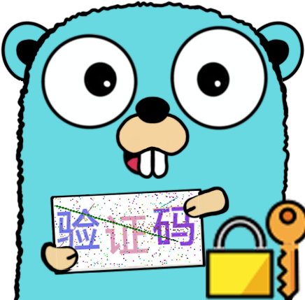

<div align="center">
  <a href="https://github.com/loommii/captcha-image-server"></a>

# captcha-image-server

[](https://golang.org/)
[](https://github.com/zeromicro/go-zero)
[](LICENSE)
[](https://hub.docker.com/r/loommii/captcha-image-server)

**基于 Go-Zero 框架开发的高性能验证码生成与校验服务**

[**特性**](#特性) • [**API 文档**](#api-文档) • [**快速开始**](#快速开始) • [**部署**](#部署) • [**配置**](#配置) • [**许可证**](#许可证)

</div>

---

## 📋 项目介绍

`captcha-image-server` 是一个基于 Go-Zero 框架开发的高性能验证码服务，提供验证码图片生成和校验功能。该项目结合了您之前开发的 `captcha-image` 库，为 Web 应用提供安全可靠的验证码验证解决方案。

## ✨ 特性

- **高性能** - 基于 Go-Zero 框架，提供高并发、低延迟的验证码服务
- **安全验证** - 生成带干扰元素的验证码图片，有效防止自动化识别
- **灵活配置** - 可配置验证码过期时间等参数
- **缓存机制** - 使用内存缓存存储验证码，支持自动过期
- **RESTful API** - 提供简洁易用的 REST API 接口
- **Docker 支持** - 提供官方 Docker 镜像，便于部署和扩展
- **多语言支持** - 支持中英文等多种语言字符
- **标准化** - 遵循 RESTful 设计规范，返回标准 JSON 格式

## 🛠️ 技术栈

- **框架**: [go-zero](https://github.com/zeromicro/go-zero) - 微服务框架
- **验证码库**: [captcha-image](https://github.com/loommii/captcha-image) - 验证码生成库
- **缓存**: go-zero 内置缓存机制
- **容器**: Docker
- **字体**: HarmonyOS Sans SC Bold

## 📦 API 文档

### 1. 服务健康检查

- **接口**: `GET /ping`
- **描述**: 检查服务是否正常运行
- **响应示例**:
```json
{
  "message": "pong",
  "time": "2025-12-18T00:30:00+08:00"
}
```

### 2. 获取验证码图片

- **接口**: `GET /captcha/image`
- **描述**: 生成并返回验证码图片
- **参数**:
  - `id` (string) - 客户端生成的唯一 ID，建议使用 UUID
- **响应示例**:
```json
{
  "id": "uuid-string",
  "expireUnix": 1700000000,
  "captchaImageB64": "iVBORw0KGgoAAAANSUhEUgAA..."
}
```
- **响应字段说明**:
  - `id`: 请求的唯一 ID
  - `expireUnix`: 验证码过期时间戳（秒）
  - `captchaImageB64`: Base64 编码的验证码图片

### 3. 校验验证码

- **接口**: `POST /captcha/Check`
- **描述**: 校验用户输入的验证码
- **请求体**:
```json
{
  "id": "uuid-string",
  "value": "验证码值"
}
```
- **响应示例**:
```json
{
  "id": "uuid-string",
  "result": true,
  "redirect": "https://loommii.github.io/"
}
```
- **响应字段说明**:
  - `id`: 验证码对应的 ID
  - `result`: 校验结果（true/false）
  - `redirect`: 成功时的重定向地址

## 🚀 快速开始

### 环境要求

- Go 1.22+
- Git

### 本地开发

1. 克隆项目：
```bash
git clone https://github.com/loommii/captcha-image-server.git
cd captcha-image-server
```

2. 安装依赖：
```bash
go mod download
```

3. 运行服务：
```bash
go run captchaimageserver.go -f etc/captchaimageserver-api.yaml
```

4. 服务默认运行在 `http://localhost:54289`

### Docker 运行

```bash
docker run -d -p 54289:54289 --name captcha-image-server loommii/captcha-image-server
```

## 📁 项目结构

```
captcha-image-server/
├── captcha-image-server.png    # 项目 logo
├── captchaImageServer.api      # go-zero API 定义
├── captchaimageserver.go       # 主程序入口
├── Dockerfile                  # Docker 构建文件
├── go.mod, go.sum              # Go 模块文件
├── README.md                   # 项目说明文档
├── .gitignore                  # Git 忽略配置
├── etc/                        # 配置文件目录
│   └── captchaimageserver-api.yaml
├── internal/                   # 内部代码
│   ├── config/                 # 配置定义
│   ├── handler/                # HTTP 处理器
│   ├── logic/                  # 业务逻辑
│   ├── svc/                    # 服务上下文
│   └── types/                  # 数据类型定义
└── scripts/
    └── font/                   # 字体文件目录
        └── HarmonyOS_Sans_SC_Bold.ttf
```

## ⚙️ 配置说明

配置文件位于 `etc/captchaimageserver-api.yaml`：

```yaml
Name: captchaImageServer-api
Host: 0.0.0.0        # 服务监听地址
Port: 54289          # 服务监听端口
Captcha:
  Expire: 300        # 验证码过期时间（秒）
```

### 配置项说明

- `Host`: 服务监听的 IP 地址
- `Port`: 服务监听的端口号
- `Captcha.Expire`: 验证码过期时间（秒），过期后验证码将失效

## 🐳 Docker 部署

### 使用官方镜像

```bash
# 拉取并运行最新版本
docker run -d -p 54289:54289 --name captcha-image-server loommii/captcha-image-server

# 指定自定义配置运行（可选）
docker run -d -p 54289:54289 -v /path/to/config:/app/etc --name captcha-image-server loommii/captcha-image-server
```

### 自定义构建

```bash
# 构建镜像
docker build -t captcha-image-server .

# 运行容器
docker run -d -p 54289:54289 --name captcha-image-server captcha-image-server
```

## 🧪 测试接口

### 示例请求

```bash
# 1. 健康检查
curl --location --request GET 'http://localhost:54289/ping'

# 2. 获取验证码图片 (使用随机生成的UUID)
curl --location --request GET 'http://localhost:54289/captcha/image?id=550e8400-e29b-41d4-a716-446655440000'

# 3. 验证验证码
curl --location --request POST 'http://localhost:54289/captcha/Check' \
--header 'Content-Type: application/json' \
--data-raw '{
    "id": "550e8400-e29b-41d4-a716-446655440000",
    "value": "验证码值"
}'
```

## 🔒 安全注意事项

- 使用唯一且随机的 ID（推荐 UUID）来防止重复请求
- 验证码具有过期机制，过期时间应在安全和用户体验之间平衡
- 在生产环境中，建议通过反向代理（如 Nginx）来提供 HTTPS 支持
- 验证码校验成功后的重定向地址可在逻辑层进行自定义

## 🤝 贡献

欢迎任何形式的贡献！您可以：

- 提交 Issue 报告 Bug 或提出功能建议
- 提交 Pull Request 改进代码
- 改善文档
- 分享这个项目给其他人

## 📄 许可证

本项目采用 MIT 许可证 - 查看 [LICENSE](LICENSE) 文件了解详情。

## 💬 联系方式

如有任何问题或建议，请通过 GitHub Issues 与我们联系。

## 🙏 致谢

感谢以下开源项目为本项目提供支持：

- [go-zero](https://github.com/zeromicro/go-zero) - 微服务框架
- [captcha-image](https://github.com/loommii/captcha-image) - 验证码生成库
- [lancet](https://github.com/duke-git/lancet) - Go 实用工具库